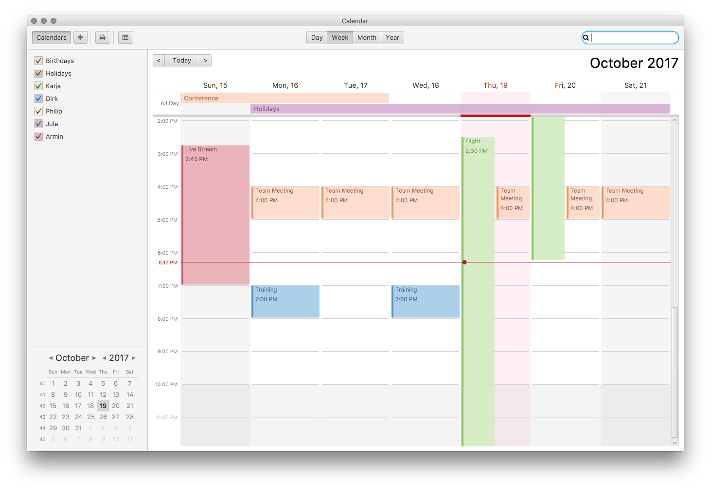

# CalendarFX
A Java framework for creating sophisticated calendar views based on JavaFX. A detailed developer manual can be found online: http://dlsc.com/wp-content/html/calendarfx/manual.html

# Modules

1. CalendarFXApp - contains a standalone application (day, week, month, year views).
2. CalendarFXAssembly - a module used for creating distributions / assemblies
3. CalendarFXExperimental - a playground for new controls
4. CalendarFXGoogle - code for working with Google calendars
5. CalendarFXiCal - code for dealing with iCal data
6. CalendarFXRecurrence - an extension for the Google recurrence API (RFC 2445). Needed for the new date and time API of Java 8
7. CalendarFXSampler - a demo app based on FXSampler to test controls individually
8. CalendarFXView - the main module containing the various calendar views
9. CalendarFXWeather - a standalone demo for the month sheet view

# Building It
Simply run the 'install' target inside the top level project. Once completed you will find the installation inside the target folder of the assembly module.

# Assemblies

There are currently two assemblies being created inside the target folder of the assembly module.
The "bin" assembly contains almost everything except for the source files.

## Binary Assembly

The following are the directories found inside the binary assembly.

### css

Contains the calendar.css file.

### demos

Contains several standalone / runnable JAR files. Demos can be started by either double clicking on them or by calling java -jar demo.jar. Make sure to use at least Java 8u60+.
   
### docs

Contains the generated JavaDocs / API HTML files.
   
### ext

Contains third party libraries that are needed for running CalendarFX (controlsfx, license4j, fontawesomefx).

### i18n

The resource bundles used by CalendarFX.
	
### lib

The actual CalendarFX libraries.
	
### misc

Property files used for logging.
	
### tutorial

Getting started files.
