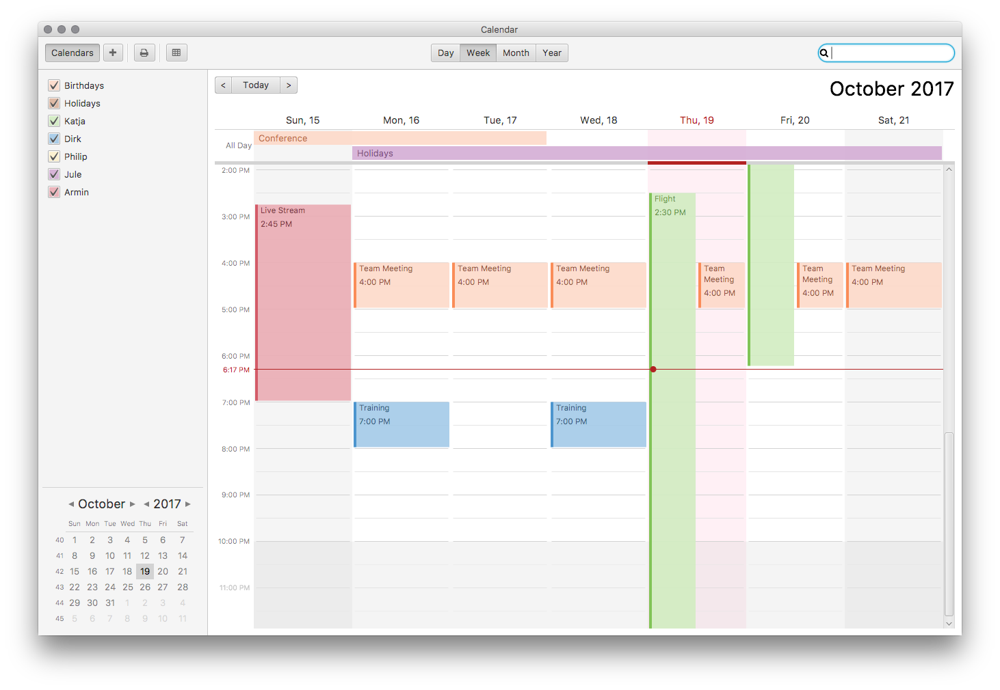

# CalendarFX
A Java framework for creating sophisticated calendar views based on JavaFX. A detailed developer manual can be found online: [CalendarFX Developer Manual](https://dlsc-software-consulting-gmbh.github.io/CalendarFX/)

[](https://www.jfx-central.com/libraries/calendarfx)

[](https://opensource.org/licenses/Apache-2.0) 
[](https://central.sonatype.com/artifact/com.calendarfx/view) 
[](https://github.com/dlsc-software-consulting-gmbh/CalendarFX/actions/workflows/build.yml)
[](https://github.com/dlsc-software-consulting-gmbh/CalendarFX/actions/workflows/codeql.yml)

[](https://sonarcloud.io/dashboard?id=dlsc-software-consulting-gmbh_CalendarFX2.fx)
[](https://sonarcloud.io/dashboard?id=dlsc-software-consulting-gmbh_CalendarFX2.fx)
[](https://sonarcloud.io/dashboard?id=dlsc-software-consulting-gmbh_CalendarFX2.fx)
[](https://sonarcloud.io/dashboard?id=dlsc-software-consulting-gmbh_CalendarFX2.fx)
[](https://sonarcloud.io/dashboard?id=dlsc-software-consulting-gmbh_CalendarFX2.fx)

For a quick online demo please checkout [JPro](https://jpro.one) and their [CalendarFX demo](https://demos.jpro.one/calendar.html).



# Repository Coordinates
CalendarFX can be found on [The Central Repository](https://central.sonatype.com/artifact/com.calendarfx/view) as `com.calendarfx:view`.

```xml
<dependency>
    <groupId>com.calendarfx</groupId>
    <artifactId>view</artifactId>
    <version>12.1.2</version>
</dependency>
```

# Requirements

CalendarFX requires **Java 21** or later and **JavaFX 23** or later.

# Modules

* CalendarFXView — the main module containing the various calendar views
* CalendarFXSampler — a demo app based on FXSampler to test controls individually
* CalendarFXApp — a demo app (day, week, month, year views).
* CalendarFXAppointmentsApp — a demo app for the appointments view
* CalendarFXiCal — a demo app for working with iCalendar data
* CalendarFXGoogle — a demo app for working with Google calendars
* CalendarFXResourceApp — a demo app for the resource calendar view
* CalendarFXSchedulerApp — a demo app for the scheduler view
* CalendarFXWeather — a demo app for the month sheet view

Only `CalendarFXView` is published. The demo modules are built via the `all-modules` Maven
profile, which is active unless `-Drelease=true` is passed.

# Running
In the module folder of the corresponding app:
```bash
mvn javafx:run
```

# Building
To install the package into the local repository, for use as a dependency in other projects locally:
```bash
./mvnw install
```

To run the tests of the library module only:
```bash
./mvnw -pl CalendarFXView test
```

# AtlantaFX

To use the AtlantaFX theming support you need to pass a system property to your application like this:

```
-Datlantafx=true
```

Or inside your application call:

```
System.setProperty("atlantafx", "true");
```

Doing so will make the controls inside CalendarFX to always use the atlantafx.css file instead of the default calendar.css file.

The last step is to set one of the AtlantaFX themes as the default theme for your application. For example:

```
Application.setUserAgentStylesheet(new NordDark().getUserAgentStylesheet());
```

Obviously all of this requires that you have the AtlantaFX library on your classpath.


# Contributing

Contributions are welcome! Please read [CONTRIBUTING.md](CONTRIBUTING.md) for the build setup,
the coding conventions and the pull request process. All participants are expected to follow
our [Code of Conduct](CODE_OF_CONDUCT.md).

# Security

Please report security vulnerabilities privately as described in [SECURITY.md](SECURITY.md) —
not via the public issue tracker.

# Support

* Usage questions: [GitHub Discussions](https://github.com/dlsc-software-consulting-gmbh/CalendarFX/discussions)
* Bugs and feature requests: [GitHub Issues](https://github.com/dlsc-software-consulting-gmbh/CalendarFX/issues)
* Commercial support and custom development: [DLSC Software & Consulting](https://www.dlsc.com)

# Changelog

Notable changes are recorded in [CHANGES.txt](CHANGES.txt).

# License

CalendarFX is licensed under the [Apache License 2.0](LICENSE).
